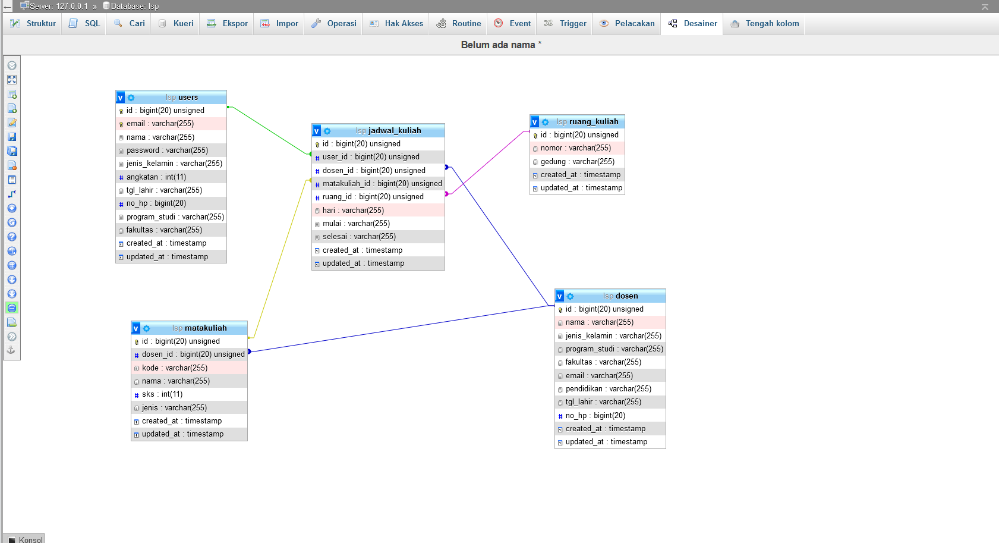
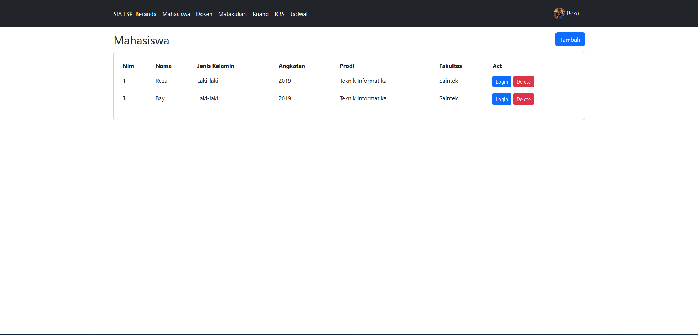
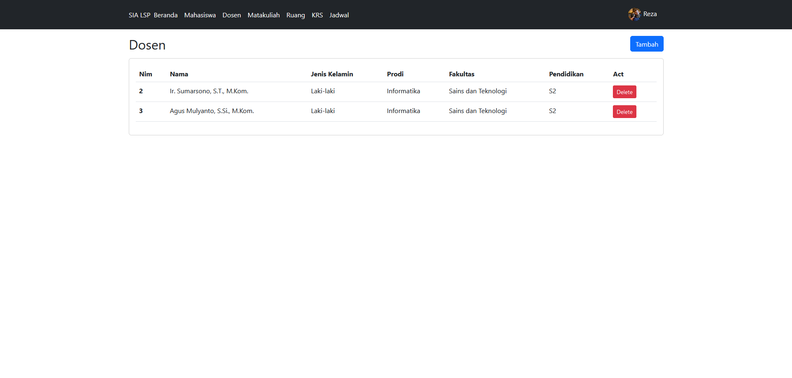
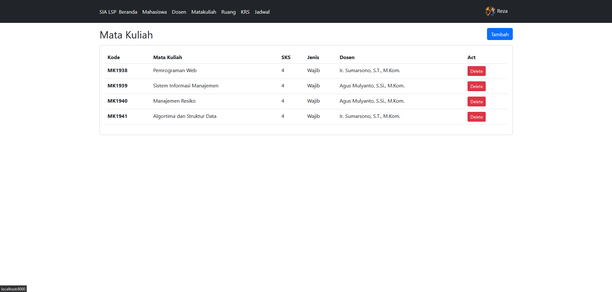
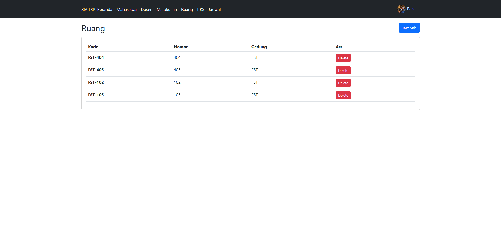
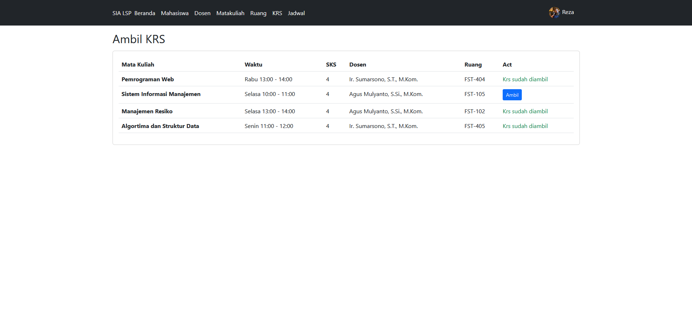
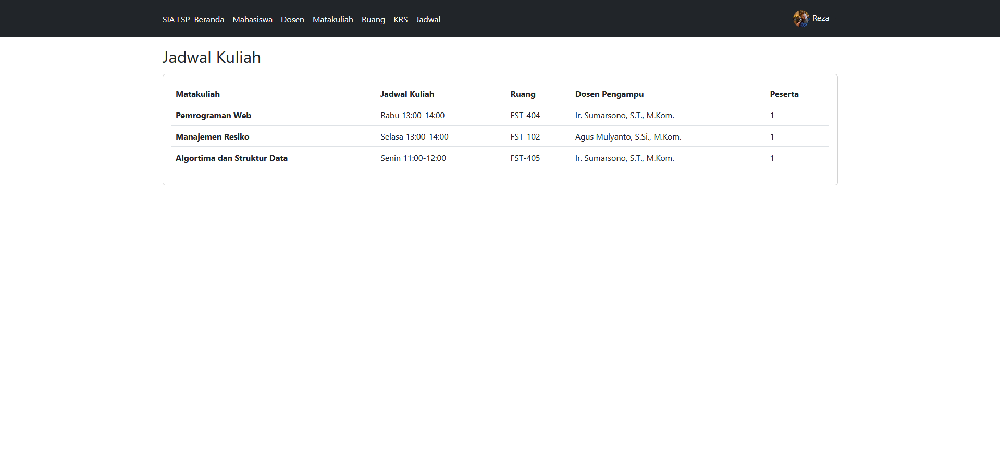

# TUGAS LSP - Sistem Informasi KRS

## Datadiri
- Nama: Reza Maulana Alfitra
- Nim: 19106050032

## Struktur Basis Data
- users (mahasiswa)
- dosen
- matakuliah
- ruang
- jadwal_kuliah

## Requirement
- composer
- php8
- mysql

## Install
- ```composer install```
- duplicate `.env.example` then rename to `.env`
- ```php artisan key:generate```
- ```php artisan migrate```
- ```php artisan server```

## Relasi Basis Data


## Screenshot Web

### Mahasiswa


### Dosen


### Mata Kuliah


### Ruang


### Ambil KRS


### Jadwal Kuliah
